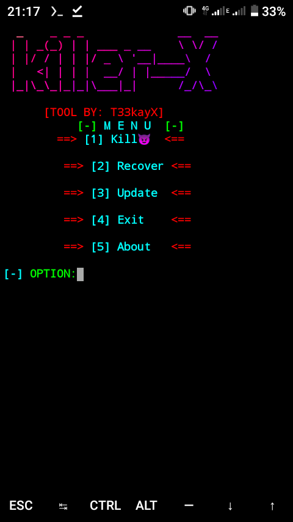

<p align="center">
<a href="https://bit.ly/3bgtjYk"></a>
</p>
<p align="center">
<a href="https://TeekaY-X.github.io"></a>
<a href="https://TeekaY-X.github.io"></a>
<a href="https://TeekaY-X.github.io"></a>
</p>

<p align="center">
<a href="https://github.com/Teekay-X"></a>
<a href="https://github.com/Teekay-X"></a>
<a href="https://github.com/Teekay-X"></a>
<a href="https://github.com/Teekay-X"></a>
<a href="https://github.com/Teekay-X"></a>
<a href="https://github.com/Teekay-X"></a>
</p>

## ABOUT TOOL :

Destro is a bash based script which is officially made for termux users and from this tool you can spread android virus by just sending link. This tool works on both rooted Android device and Non-rooted Android device.

## Preview :


<p align="center">
  
</p>


## Available On

* Termux

### TESTED ON :

* Termux

### REQUIREMENTS :
* internet
* external storage permission
* figlet & toilet
## FEATURES :
* [+] Dangerous virus tool !
* [+] Easy for beginners !
* [+] Working virus tool for termux !

## INSTALLATION [Termux] :

* `apt-get update -y`
* `apt-get upgrade -y`
* `pkg install python -y`
* `pkg install python2 -y`
* `pkg install git -y`
* `pip install lolcat`
* `git clone https://github.com/Teekay-X/Destro`
* `cd $HOME`
* `ls`
* `cd Destro`
* `ls`
* `bash destro.sh`
```
[+]-- Now you need internet connection to continue further process...
[+]-- You can select any option by clicking on your keyboard
```


<br>


## WARNING : 
***This Tool is only for educational purpose. If you use this tool for other purposes except education T33kayX will not be responsible in such cases.***

## By: Asahluma Tyika
